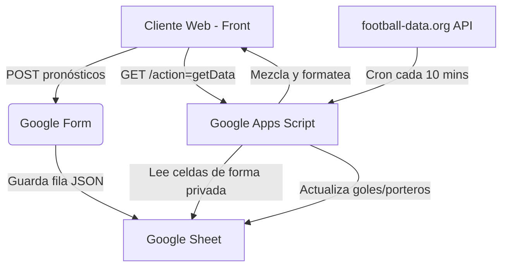

# 🏆 La Porra del Mundial 2026

Una aplicación web moderna y reactiva para gestionar una porra de fútbol entre colegas durante el Mundial de la FIFA 2026. Desplegable de forma estática y 100% gratuita usando **GitHub Pages**, utilizando **Google Sheets** como base de datos privada y **Google Apps Script** como motor API de backend y sincronización en tiempo real.

> [!IMPORTANT]
> **Arquitectura Privada y Simplificada:** Gracias a la última actualización, la aplicación carga todos los datos a través de un único endpoint seguro del Apps Script. **Ya no es necesario publicar tus hojas de cálculo como CSV públicos en la web**, protegiendo la privacidad de los participantes y sus pronósticos.

---

## 🌟 Características Principales

* **⚽ Predicciones Interactivas (M1):** Pronósticos de marcadores exactos con asignación de "Partido Salvaje" (puntuación doble) por jornada.
* **🎯 Goleador y Portero de la Jornada (M2/M3):** Elecciones estratégicas por ronda de un goleador (+1 punto por gol) y portero (+2 si imbatido, +1 si recibe 1 gol, resta si recibe 2+).
* **🏆 Apuestas Especiales (M4):** Eventos de larga duración durante el torneo (Semifinalistas, Campeón, etc.).
* **📈 Panel "El Mundial":** Visualización del calendario, standings de los 12 grupos del Mundial 2026 y tabla de goleadores de la FIFA.
* **📰 "El Diario de la Porra":** Portada de periódico vintage/satírico redactada automáticamente por **Gemini (IA)** que analiza los resultados de la jornada con ironía y humor. ¡Permite exportación a PDF listo para imprimir!
* **🔮 "El Oráculo de la Porra":** Un chatbot analista integrado alimentado por **Gemma** para responder dudas futbolísticas de los usuarios y analizar con sarcasmo el rendimiento de cada uno.
* **⚽ Widget de Marcadores en Vivo:** Componente flotante conectado en directo a la API de `worldcup26.ir` que muestra los partidos en vivo, minutos y resultados en tiempo real, adaptando los horarios de los 16 estadios a tu zona horaria local.
* **🔧 Panel de Control Administrador:** Interfaz interna protegida por contraseña para añadir/eliminar participantes, gestionar estados de pago, forzar sincronización de resultados y restablecer el torneo.

---

## 🚀 Guía Rápida de Configuración (Quick Path)

Sigue estos 5 pasos para desplegar tu porra en menos de 15 minutos:

### 1. Importar la Base de Datos
1. Sube el archivo [porra_mundial_db.xlsx](file:///C:/Fabio/Programacion/ProyectosPersonales/porra-mundial/porra_mundial_db.xlsx) a tu Google Drive.
2. Ábrelo con **Google Sheets** y guárdalo como documento de Google Sheets (archivo nativo). Contiene las pestañas `participants`, `matches` (los 104 partidos precargados), `players`, `special_events` y la pestaña de configuración `config`.

### 2. Crear el Formulario de Entrega
Para recibir los pronósticos de los jugadores de forma automatizada:
1. En Google Drive, crea un **Formulario de Google** vacío.
2. Añade **una única pregunta** de tipo **Párrafo (Texto largo)** llamada `Pronósticos (JSON)`.
3. Obtén el **ID del Formulario** (desde su URL de edición: `.../d/UN_ID_LARGO/edit`) y el **ID del campo de texto** (`entry.XXXXX` inspeccionando el campo del formulario en su vista pública).
4. Vincula el formulario a tu hoja de cálculo anterior (**Respuestas > Vincular con Hojas de cálculo**) para que cree la pestaña `Respuestas de formulario 1`.

### 3. Configurar el Backend (Google Apps Script)
1. En tu Google Sheet, ve a **Extensiones > Apps Script**.
2. Copia todo el código de [google-apps-script.gs](file:///C:/Fabio/Programacion/ProyectosPersonales/porra-mundial/google-apps-script.gs) en tu archivo `Código.gs`.
3. Crea un nuevo archivo en el proyecto de Apps Script llamado `results.gs` y pega el contenido de [apps-script-results.gs](file:///C:/Fabio/Programacion/ProyectosPersonales/porra-mundial/apps-script-results.gs).
4. Configura las variables de entorno en ⚙️ **Configuración del proyecto > Propiedades del script**:
   - `ADMIN_PASSWORD`: La contraseña para acceder al panel de administración de la web.
   - `GEMINI_API_KEY`: Clave gratuita de Google AI Studio para redactar el periódico y dar vida al Oráculo.
   - `FD_TOKEN`: Tu token gratuito de [football-data.org](https://www.football-data.org/) para auto-sincronizar resultados reales.
5. Despliega como **Aplicación Web**: Haz clic en **Nueva implementación > Tipo: Aplicación Web > Ejecutar como: Tú > Quién tiene acceso: Cualquiera**. Copia la URL generada (`https://script.google.com/.../exec`).

> [!TIP]
> **🔄 Cómo actualizar el código en Apps Script:**
> Si actualizas los archivos `.gs` locales en el futuro y deseas desplegar los cambios sin que cambie tu URL pública de la API:
> 1. Copia el contenido nuevo en tu Apps Script en Google Drive.
> 2. Haz clic en **Implementar > Gestionar implementaciones** (arriba a la derecha).
> 3. Selecciona tu implementación activa de la barra lateral, haz clic en el icono del **lápiz (Editar)**.
> 4. En el menú desplegable de "Versión", selecciona **Nueva versión** (es muy importante este paso, de lo contrario Google no recompilará los cambios).
> 5. Haz clic en **Implementar** y listo. Tu URL seguirá siendo la misma pero con el código actualizado corriendo en producción.

### 4. Configurar la Aplicación Web
Edita el archivo [config.js](file:///C:/Fabio/Programacion/ProyectosPersonales/porra-mundial/config.js) en tu copia local:
```javascript
const CONFIG = {
  appName: "La Porra del Mundial",
  appsScriptUrl: "https://script.google.com/macros/s/TU_URL_APPS_SCRIPT/exec",
  
  googleForm: {
    formId: "TU_GOOGLE_FORM_ID",
    entryId: "entry.TU_ENTRY_ID"
  },
  
  // Puedes dejar las googleSheets vacías si usas appsScriptUrl (¡muy recomendado!)
  googleSheets: {} 
};
```

### 5. Desplegar
Sube los archivos a tu repositorio de GitHub y activa **GitHub Pages** en la configuración del repositorio (**Settings > Pages > Deploy from branch: main**). ¡Tu porra ya estará online y totalmente funcional!

---

## 📊 Arquitectura de Datos y Sincronización



| Componente | Rol | Beneficio / Tradeoff |
|------------|-----|----------------------|
| **Frontend Estático** | Interfaz reactiva HTML/JS/CSS | Despliegue gratuito en GitHub Pages, rapidez extrema y soporte SPA. |
| **Google Sheets** | Base de datos | Sin servidores ni costes. Interfaz de hoja de cálculo familiar para correcciones manuales. |
| **Google Apps Script** | API Gateway & Sincronizador | Proxy seguro que evita exponer el Spreadsheet ID y permite el cálculo de puntos y llamadas a IA. |

---

## 🛠️ Tareas de Mantenimiento Comunes (Admin Web Panel)

Desde el panel de `/admin.html` puedes gestionar las tareas cotidianas del torneo sin abrir Google Sheets:
- **➕ Añadir Participantes:** Registra nuevos nombres y estados de pago al instante. El sistema auto-genera sus IDs internos.
- **🗑️ Eliminar Participantes:** Quita a jugadores de la clasificación si hay cancelaciones.
- **⚙️ Configuración al Vuelo:** Cambia el nombre de la porra, el precio de entrada y el premio directamente desde la UI sin modificar código.
- **🔄 Sincronizar Resultados:** Fuerza al cron de Apps Script a conectarse con la API de fútbol y actualizar los partidos al momento.
- **🔒 Cerrar Jornadas:** Cierra la jornada en curso de forma segura guardando los snapshots de goleadores y calculando puntos de porteros.
- **📰 Redactar Crónica:** Solicita a Gemini que analice la clasificación actual y redacte el periódico deportivo humorístico de la ronda.

---

## 📚 Desarrollo y Tests

El proyecto incluye tests unitarios para validar las reglas de puntuación y la lógica del Apps Script en local:

```bash
# Instalar dependencias
pnpm install

# Ejecutar el conjunto de tests unitarios
pnpm test
```
